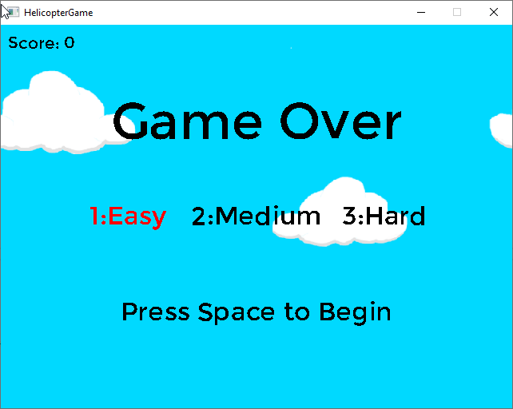

# HelicopterGame
Remake of classic obstacle dodging game written in C++ and SDL2.

This project was made for the purpose of brushing up on C++. While the game is admittedly simple, it did provide the opportunity for some hands-on practice with C++, particularly with regards to classes and manual memory management.
